# 웨어러블 라이프로그를 이용한 치매 예측

> 기계학습기초 2022-1 미니프로젝트

- e비즈니스학과 201823871 박지헌

```python
import pandas as pd
import numpy as np
import matplotlib.pyplot as plt
import seaborn as sns
from matplotlib.colors import ListedColormap
from sklearn import datasets
from sklearn.model_selection import train_test_split
from sklearn.metrics import accuracy_score, f1_score, confusion_matrix, roc_curve,roc_auc_score
from sklearn.neighbors import KNeighborsClassifier
from sklearn.pipeline import Pipeline
import warnings
warnings.filterwarnings('ignore')
from sklearn.model_selection import train_test_split #split 패키지
from sklearn import preprocessing
from sklearn.linear_model import LogisticRegression
from sklearn.tree import DecisionTreeClassifier
from sklearn.ensemble import RandomForestClassifier
pd.set_option('display.max_columns', None)
# pd.set_option('display.max_rows', 5)
from sklearn.neighbors import KNeighborsClassifier
from sklearn.model_selection import cross_val_score
from sklearn.metrics import roc_curve, auc
from sklearn.naive_bayes import GaussianNB
from sklearn.svm import SVC
from sklearn.model_selection import cross_val_score
from sklearn.model_selection import GridSearchCV
import xgboost as xgb
from xgboost import plot_tree
import os
from graphviz import Source
from sklearn.tree import export_graphviz
PROJECT_ROOT_DIR = "."
CHAPTER_ID = "decision_trees"
IMAGES_PATH = os.path.join(PROJECT_ROOT_DIR, "images", CHAPTER_ID)
os.makedirs(IMAGES_PATH, exist_ok=True)
```

# 1. EDA

## 1.1 결측치 제거

```python
raw=pd.read_csv("train.csv")
raw = raw.replace('...', None)
raw = raw.iloc[:,:-8]
raw = raw.dropna(axis = 1)
label = pd.read_csv("train_label.csv") ;label

df = pd.merge(raw,label, how='inner', left_on='EMAIL', right_on='SAMPLE_EMAIL')
df.drop(['EMAIL', 'summary_date','SAMPLE_EMAIL', 'sleep_period_id'], axis = 1, inplace = True)
df['DIAG_NM'].replace('CN', 0, inplace=True)
df['DIAG_NM'].replace('MCI', 1, inplace=True)
df['DIAG_NM'].replace('Dem', 2, inplace=True)

df.describe()

v_dict = {}
for i in list(df.columns):
    v_dict[i] = df[i].value_counts().shape[0]

pd.DataFrame(v_dict,index=["unique count"]).transpose()

df.info()

df
```

    <class 'pandas.core.frame.DataFrame'>
    Int64Index: 9327 entries, 0 to 9326
    Data columns (total 50 columns):
     #   Column                             Non-Null Count  Dtype
    ---  ------                             --------------  -----
     0   activity_average_met               9327 non-null   float64
     1   activity_cal_active                9327 non-null   int64
     2   activity_cal_total                 9327 non-null   int64
     3   activity_daily_movement            9327 non-null   int64
     4   activity_high                      9327 non-null   int64
     5   activity_inactive                  9327 non-null   int64
     6   activity_inactivity_alerts         9327 non-null   int64
     7   activity_low                       9327 non-null   int64
     8   activity_medium                    9327 non-null   int64
     9   activity_met_min_high              9327 non-null   int64
     10  activity_met_min_inactive          9327 non-null   int64
     11  activity_met_min_low               9327 non-null   int64
     12  activity_met_min_medium            9327 non-null   int64
     13  activity_non_wear                  9327 non-null   int64
     14  activity_rest                      9327 non-null   int64
     15  activity_score                     9327 non-null   int64
     16  activity_score_meet_daily_targets  9327 non-null   int64
     17  activity_score_move_every_hour     9327 non-null   int64
     18  activity_score_recovery_time       9327 non-null   int64
     19  activity_score_stay_active         9327 non-null   int64
     20  activity_score_training_frequency  9327 non-null   int64
     21  activity_score_training_volume     9327 non-null   int64
     22  activity_steps                     9327 non-null   int64
     23  activity_total                     9327 non-null   int64
     24  sleep_awake                        9327 non-null   int64
     25  sleep_breath_average               9327 non-null   float64
     26  sleep_deep                         9327 non-null   int64
     27  sleep_duration                     9327 non-null   int64
     28  sleep_efficiency                   9327 non-null   int64
     29  sleep_hr_average                   9327 non-null   float64
     30  sleep_hr_lowest                    9327 non-null   int64
     31  sleep_is_longest                   9327 non-null   int64
     32  sleep_light                        9327 non-null   int64
     33  sleep_midpoint_at_delta            9327 non-null   int64
     34  sleep_midpoint_time                9327 non-null   int64
     35  sleep_onset_latency                9327 non-null   int64
     36  sleep_rem                          9327 non-null   int64
     37  sleep_restless                     9327 non-null   int64
     38  sleep_rmssd                        9327 non-null   int64
     39  sleep_score                        9327 non-null   int64
     40  sleep_score_alignment              9327 non-null   int64
     41  sleep_score_deep                   9327 non-null   int64
     42  sleep_score_disturbances           9327 non-null   int64
     43  sleep_score_efficiency             9327 non-null   int64
     44  sleep_score_latency                9327 non-null   int64
     45  sleep_score_rem                    9327 non-null   int64
     46  sleep_score_total                  9327 non-null   int64
     47  sleep_temperature_delta            9327 non-null   float64
     48  sleep_temperature_deviation        9327 non-null   float64
     49  DIAG_NM                            9327 non-null   int64
    dtypes: float64(5), int64(45)
    memory usage: 3.6 MB

<div>
<style scoped>
    .dataframe tbody tr th:only-of-type {
        vertical-align: middle;
    }

    .dataframe tbody tr th {
        vertical-align: top;
    }

    .dataframe thead th {
        text-align: right;
    }

</style>
<table border="1" class="dataframe">
  <thead>
    <tr style="text-align: right;">
      <th></th>
      <th>activity_average_met</th>
      <th>activity_cal_active</th>
      <th>activity_cal_total</th>
      <th>activity_daily_movement</th>
      <th>activity_high</th>
      <th>activity_inactive</th>
      <th>activity_inactivity_alerts</th>
      <th>activity_low</th>
      <th>activity_medium</th>
      <th>activity_met_min_high</th>
      <th>activity_met_min_inactive</th>
      <th>activity_met_min_low</th>
      <th>activity_met_min_medium</th>
      <th>activity_non_wear</th>
      <th>activity_rest</th>
      <th>activity_score</th>
      <th>activity_score_meet_daily_targets</th>
      <th>activity_score_move_every_hour</th>
      <th>activity_score_recovery_time</th>
      <th>activity_score_stay_active</th>
      <th>activity_score_training_frequency</th>
      <th>activity_score_training_volume</th>
      <th>activity_steps</th>
      <th>activity_total</th>
      <th>sleep_awake</th>
      <th>sleep_breath_average</th>
      <th>sleep_deep</th>
      <th>sleep_duration</th>
      <th>sleep_efficiency</th>
      <th>sleep_hr_average</th>
      <th>sleep_hr_lowest</th>
      <th>sleep_is_longest</th>
      <th>sleep_light</th>
      <th>sleep_midpoint_at_delta</th>
      <th>sleep_midpoint_time</th>
      <th>sleep_onset_latency</th>
      <th>sleep_rem</th>
      <th>sleep_restless</th>
      <th>sleep_rmssd</th>
      <th>sleep_score</th>
      <th>sleep_score_alignment</th>
      <th>sleep_score_deep</th>
      <th>sleep_score_disturbances</th>
      <th>sleep_score_efficiency</th>
      <th>sleep_score_latency</th>
      <th>sleep_score_rem</th>
      <th>sleep_score_total</th>
      <th>sleep_temperature_delta</th>
      <th>sleep_temperature_deviation</th>
      <th>DIAG_NM</th>
    </tr>
  </thead>
  <tbody>
    <tr>
      <th>0</th>
      <td>1.71875</td>
      <td>730</td>
      <td>2944</td>
      <td>14346</td>
      <td>0</td>
      <td>417</td>
      <td>0</td>
      <td>545</td>
      <td>47</td>
      <td>0</td>
      <td>7</td>
      <td>432</td>
      <td>160</td>
      <td>32</td>
      <td>399</td>
      <td>96</td>
      <td>95</td>
      <td>100</td>
      <td>100</td>
      <td>86</td>
      <td>100</td>
      <td>98</td>
      <td>15867</td>
      <td>592</td>
      <td>13950</td>
      <td>16.500</td>
      <td>2100</td>
      <td>35460</td>
      <td>61</td>
      <td>70.53</td>
      <td>62</td>
      <td>1</td>
      <td>15030</td>
      <td>6693</td>
      <td>17280</td>
      <td>960</td>
      <td>4380</td>
      <td>47</td>
      <td>20</td>
      <td>62</td>
      <td>100</td>
      <td>41</td>
      <td>50</td>
      <td>27</td>
      <td>97</td>
      <td>66</td>
      <td>62</td>
      <td>-0.12</td>
      <td>-0.12</td>
      <td>0</td>
    </tr>
    <tr>
      <th>1</th>
      <td>1.40625</td>
      <td>342</td>
      <td>2449</td>
      <td>6352</td>
      <td>0</td>
      <td>473</td>
      <td>0</td>
      <td>392</td>
      <td>8</td>
      <td>0</td>
      <td>8</td>
      <td>249</td>
      <td>24</td>
      <td>29</td>
      <td>538</td>
      <td>91</td>
      <td>78</td>
      <td>100</td>
      <td>100</td>
      <td>83</td>
      <td>100</td>
      <td>97</td>
      <td>7755</td>
      <td>400</td>
      <td>7680</td>
      <td>17.375</td>
      <td>2430</td>
      <td>24720</td>
      <td>69</td>
      <td>68.01</td>
      <td>63</td>
      <td>1</td>
      <td>12210</td>
      <td>10495</td>
      <td>11490</td>
      <td>690</td>
      <td>2400</td>
      <td>56</td>
      <td>19</td>
      <td>54</td>
      <td>100</td>
      <td>49</td>
      <td>43</td>
      <td>46</td>
      <td>91</td>
      <td>35</td>
      <td>44</td>
      <td>-0.32</td>
      <td>-0.32</td>
      <td>0</td>
    </tr>
    <tr>
      <th>2</th>
      <td>1.46875</td>
      <td>401</td>
      <td>2544</td>
      <td>7297</td>
      <td>0</td>
      <td>586</td>
      <td>0</td>
      <td>362</td>
      <td>24</td>
      <td>0</td>
      <td>14</td>
      <td>240</td>
      <td>76</td>
      <td>9</td>
      <td>459</td>
      <td>93</td>
      <td>95</td>
      <td>100</td>
      <td>100</td>
      <td>71</td>
      <td>96</td>
      <td>96</td>
      <td>8341</td>
      <td>386</td>
      <td>11880</td>
      <td>17.000</td>
      <td>2820</td>
      <td>33240</td>
      <td>64</td>
      <td>64.89</td>
      <td>59</td>
      <td>1</td>
      <td>15780</td>
      <td>5439</td>
      <td>17460</td>
      <td>1140</td>
      <td>2760</td>
      <td>48</td>
      <td>26</td>
      <td>61</td>
      <td>100</td>
      <td>56</td>
      <td>47</td>
      <td>34</td>
      <td>89</td>
      <td>41</td>
      <td>62</td>
      <td>0.07</td>
      <td>0.07</td>
      <td>0</td>
    </tr>
    <tr>
      <th>3</th>
      <td>0.34375</td>
      <td>27</td>
      <td>1850</td>
      <td>491</td>
      <td>0</td>
      <td>176</td>
      <td>0</td>
      <td>34</td>
      <td>1</td>
      <td>0</td>
      <td>1</td>
      <td>18</td>
      <td>3</td>
      <td>19</td>
      <td>1210</td>
      <td>93</td>
      <td>95</td>
      <td>100</td>
      <td>100</td>
      <td>74</td>
      <td>96</td>
      <td>92</td>
      <td>8122</td>
      <td>35</td>
      <td>9600</td>
      <td>17.250</td>
      <td>1770</td>
      <td>29700</td>
      <td>68</td>
      <td>63.70</td>
      <td>57</td>
      <td>1</td>
      <td>16350</td>
      <td>7241</td>
      <td>15750</td>
      <td>1170</td>
      <td>1980</td>
      <td>59</td>
      <td>30</td>
      <td>55</td>
      <td>100</td>
      <td>35</td>
      <td>40</td>
      <td>44</td>
      <td>86</td>
      <td>29</td>
      <td>56</td>
      <td>-0.41</td>
      <td>-0.41</td>
      <td>0</td>
    </tr>
    <tr>
      <th>4</th>
      <td>1.46875</td>
      <td>333</td>
      <td>2518</td>
      <td>5861</td>
      <td>0</td>
      <td>646</td>
      <td>0</td>
      <td>377</td>
      <td>6</td>
      <td>0</td>
      <td>15</td>
      <td>240</td>
      <td>19</td>
      <td>19</td>
      <td>392</td>
      <td>88</td>
      <td>95</td>
      <td>100</td>
      <td>100</td>
      <td>65</td>
      <td>71</td>
      <td>80</td>
      <td>7378</td>
      <td>383</td>
      <td>10710</td>
      <td>17.250</td>
      <td>3150</td>
      <td>31440</td>
      <td>66</td>
      <td>67.07</td>
      <td>60</td>
      <td>1</td>
      <td>14010</td>
      <td>6037</td>
      <td>17220</td>
      <td>3360</td>
      <td>3570</td>
      <td>42</td>
      <td>23</td>
      <td>56</td>
      <td>100</td>
      <td>64</td>
      <td>55</td>
      <td>39</td>
      <td>14</td>
      <td>54</td>
      <td>59</td>
      <td>-0.27</td>
      <td>-0.27</td>
      <td>0</td>
    </tr>
    <tr>
      <th>...</th>
      <td>...</td>
      <td>...</td>
      <td>...</td>
      <td>...</td>
      <td>...</td>
      <td>...</td>
      <td>...</td>
      <td>...</td>
      <td>...</td>
      <td>...</td>
      <td>...</td>
      <td>...</td>
      <td>...</td>
      <td>...</td>
      <td>...</td>
      <td>...</td>
      <td>...</td>
      <td>...</td>
      <td>...</td>
      <td>...</td>
      <td>...</td>
      <td>...</td>
      <td>...</td>
      <td>...</td>
      <td>...</td>
      <td>...</td>
      <td>...</td>
      <td>...</td>
      <td>...</td>
      <td>...</td>
      <td>...</td>
      <td>...</td>
      <td>...</td>
      <td>...</td>
      <td>...</td>
      <td>...</td>
      <td>...</td>
      <td>...</td>
      <td>...</td>
      <td>...</td>
      <td>...</td>
      <td>...</td>
      <td>...</td>
      <td>...</td>
      <td>...</td>
      <td>...</td>
      <td>...</td>
      <td>...</td>
      <td>...</td>
      <td>...</td>
    </tr>
    <tr>
      <th>9322</th>
      <td>1.34375</td>
      <td>227</td>
      <td>2316</td>
      <td>3863</td>
      <td>3</td>
      <td>735</td>
      <td>2</td>
      <td>155</td>
      <td>17</td>
      <td>21</td>
      <td>11</td>
      <td>98</td>
      <td>57</td>
      <td>0</td>
      <td>530</td>
      <td>72</td>
      <td>43</td>
      <td>78</td>
      <td>100</td>
      <td>49</td>
      <td>71</td>
      <td>97</td>
      <td>4453</td>
      <td>175</td>
      <td>6360</td>
      <td>16.250</td>
      <td>2640</td>
      <td>32760</td>
      <td>81</td>
      <td>60.21</td>
      <td>52</td>
      <td>1</td>
      <td>18210</td>
      <td>8734</td>
      <td>16110</td>
      <td>810</td>
      <td>5550</td>
      <td>57</td>
      <td>29</td>
      <td>76</td>
      <td>100</td>
      <td>53</td>
      <td>46</td>
      <td>74</td>
      <td>97</td>
      <td>84</td>
      <td>82</td>
      <td>-0.16</td>
      <td>-0.16</td>
      <td>0</td>
    </tr>
    <tr>
      <th>9323</th>
      <td>1.34375</td>
      <td>249</td>
      <td>2351</td>
      <td>4411</td>
      <td>1</td>
      <td>780</td>
      <td>4</td>
      <td>167</td>
      <td>22</td>
      <td>7</td>
      <td>10</td>
      <td>106</td>
      <td>82</td>
      <td>0</td>
      <td>470</td>
      <td>61</td>
      <td>25</td>
      <td>43</td>
      <td>100</td>
      <td>45</td>
      <td>40</td>
      <td>95</td>
      <td>4972</td>
      <td>190</td>
      <td>6000</td>
      <td>15.875</td>
      <td>1710</td>
      <td>33360</td>
      <td>82</td>
      <td>63.75</td>
      <td>57</td>
      <td>1</td>
      <td>19320</td>
      <td>8017</td>
      <td>16680</td>
      <td>450</td>
      <td>6330</td>
      <td>52</td>
      <td>18</td>
      <td>77</td>
      <td>100</td>
      <td>34</td>
      <td>57</td>
      <td>76</td>
      <td>81</td>
      <td>95</td>
      <td>86</td>
      <td>-0.09</td>
      <td>-0.09</td>
      <td>0</td>
    </tr>
    <tr>
      <th>9324</th>
      <td>1.53125</td>
      <td>570</td>
      <td>2682</td>
      <td>11057</td>
      <td>1</td>
      <td>518</td>
      <td>1</td>
      <td>332</td>
      <td>61</td>
      <td>7</td>
      <td>7</td>
      <td>257</td>
      <td>198</td>
      <td>0</td>
      <td>528</td>
      <td>78</td>
      <td>43</td>
      <td>95</td>
      <td>100</td>
      <td>76</td>
      <td>71</td>
      <td>93</td>
      <td>11878</td>
      <td>394</td>
      <td>5700</td>
      <td>16.125</td>
      <td>0</td>
      <td>27720</td>
      <td>79</td>
      <td>67.40</td>
      <td>61</td>
      <td>1</td>
      <td>16140</td>
      <td>10129</td>
      <td>14070</td>
      <td>600</td>
      <td>5880</td>
      <td>57</td>
      <td>15</td>
      <td>65</td>
      <td>100</td>
      <td>1</td>
      <td>56</td>
      <td>69</td>
      <td>86</td>
      <td>89</td>
      <td>64</td>
      <td>0.41</td>
      <td>0.41</td>
      <td>0</td>
    </tr>
    <tr>
      <th>9325</th>
      <td>1.34375</td>
      <td>295</td>
      <td>2331</td>
      <td>5135</td>
      <td>4</td>
      <td>578</td>
      <td>0</td>
      <td>173</td>
      <td>30</td>
      <td>28</td>
      <td>8</td>
      <td>99</td>
      <td>107</td>
      <td>0</td>
      <td>655</td>
      <td>70</td>
      <td>25</td>
      <td>100</td>
      <td>100</td>
      <td>70</td>
      <td>40</td>
      <td>95</td>
      <td>5752</td>
      <td>207</td>
      <td>5070</td>
      <td>15.625</td>
      <td>480</td>
      <td>35460</td>
      <td>86</td>
      <td>64.84</td>
      <td>60</td>
      <td>1</td>
      <td>22170</td>
      <td>10630</td>
      <td>17490</td>
      <td>1140</td>
      <td>7740</td>
      <td>52</td>
      <td>17</td>
      <td>81</td>
      <td>100</td>
      <td>9</td>
      <td>59</td>
      <td>86</td>
      <td>89</td>
      <td>98</td>
      <td>97</td>
      <td>0.27</td>
      <td>0.27</td>
      <td>0</td>
    </tr>
    <tr>
      <th>9326</th>
      <td>1.31250</td>
      <td>186</td>
      <td>2280</td>
      <td>3178</td>
      <td>0</td>
      <td>778</td>
      <td>1</td>
      <td>138</td>
      <td>18</td>
      <td>0</td>
      <td>11</td>
      <td>86</td>
      <td>56</td>
      <td>113</td>
      <td>393</td>
      <td>66</td>
      <td>25</td>
      <td>95</td>
      <td>100</td>
      <td>47</td>
      <td>40</td>
      <td>93</td>
      <td>3852</td>
      <td>156</td>
      <td>2040</td>
      <td>15.875</td>
      <td>2220</td>
      <td>27840</td>
      <td>93</td>
      <td>67.05</td>
      <td>60</td>
      <td>1</td>
      <td>17880</td>
      <td>4545</td>
      <td>14040</td>
      <td>630</td>
      <td>5700</td>
      <td>48</td>
      <td>16</td>
      <td>79</td>
      <td>100</td>
      <td>44</td>
      <td>59</td>
      <td>98</td>
      <td>89</td>
      <td>86</td>
      <td>80</td>
      <td>-0.05</td>
      <td>-0.05</td>
      <td>0</td>
    </tr>
  </tbody>
</table>
<p>9327 rows × 50 columns</p>
</div>

## 1.2 시각화

```python
fig, axs = plt.subplots(ncols=5, nrows=10, figsize=(15, 30))
index = 0
axs = axs.flatten()
for label, content in df.items():
    sns.boxplot(y=label, data=df, ax=axs[index])
    index += 1
plt.tight_layout(pad=0.4, w_pad=0.5, h_pad=5.0)
```

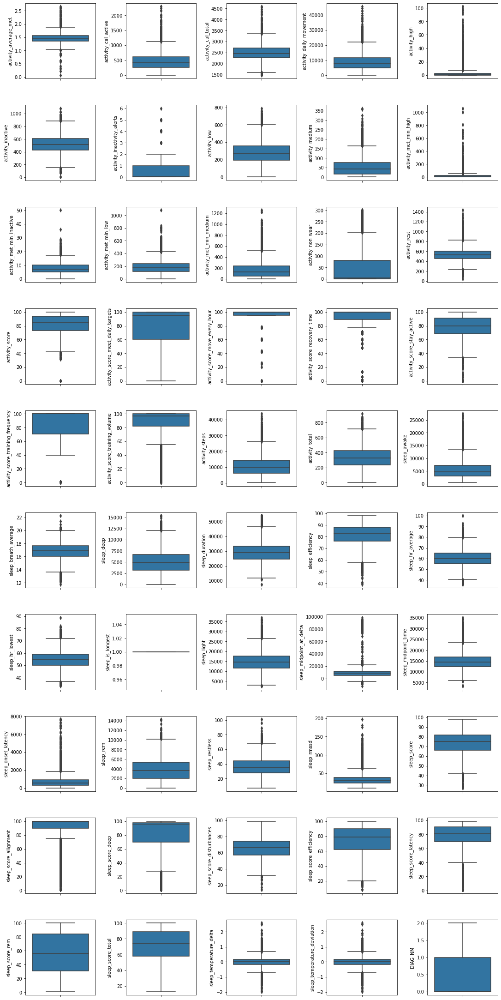

```python
fig, axs = plt.subplots(ncols=5, nrows=10, figsize=(15, 30))
index = 0
axs = axs.flatten()
for label, content in df.items():
    sns.distplot(content, ax=axs[index])
    index += 1
plt.tight_layout()
```


```python
df['sleep_is_longest'].unique()
```

    array([1], dtype=int64)

```python
df.drop(['sleep_is_longest'], axis = 1, inplace = True)
```

```python
df
```

<div>
<style scoped>
    .dataframe tbody tr th:only-of-type {
        vertical-align: middle;
    }

    .dataframe tbody tr th {
        vertical-align: top;
    }

    .dataframe thead th {
        text-align: right;
    }

</style>
<table border="1" class="dataframe">
  <thead>
    <tr style="text-align: right;">
      <th></th>
      <th>activity_average_met</th>
      <th>activity_cal_active</th>
      <th>activity_cal_total</th>
      <th>activity_daily_movement</th>
      <th>activity_high</th>
      <th>activity_inactive</th>
      <th>activity_inactivity_alerts</th>
      <th>activity_low</th>
      <th>activity_medium</th>
      <th>activity_met_min_high</th>
      <th>activity_met_min_inactive</th>
      <th>activity_met_min_low</th>
      <th>activity_met_min_medium</th>
      <th>activity_non_wear</th>
      <th>activity_rest</th>
      <th>activity_score</th>
      <th>activity_score_meet_daily_targets</th>
      <th>activity_score_move_every_hour</th>
      <th>activity_score_recovery_time</th>
      <th>activity_score_stay_active</th>
      <th>activity_score_training_frequency</th>
      <th>activity_score_training_volume</th>
      <th>activity_steps</th>
      <th>activity_total</th>
      <th>sleep_awake</th>
      <th>sleep_breath_average</th>
      <th>sleep_deep</th>
      <th>sleep_duration</th>
      <th>sleep_efficiency</th>
      <th>sleep_hr_average</th>
      <th>sleep_hr_lowest</th>
      <th>sleep_light</th>
      <th>sleep_midpoint_at_delta</th>
      <th>sleep_midpoint_time</th>
      <th>sleep_onset_latency</th>
      <th>sleep_rem</th>
      <th>sleep_restless</th>
      <th>sleep_rmssd</th>
      <th>sleep_score</th>
      <th>sleep_score_alignment</th>
      <th>sleep_score_deep</th>
      <th>sleep_score_disturbances</th>
      <th>sleep_score_efficiency</th>
      <th>sleep_score_latency</th>
      <th>sleep_score_rem</th>
      <th>sleep_score_total</th>
      <th>sleep_temperature_delta</th>
      <th>sleep_temperature_deviation</th>
      <th>DIAG_NM</th>
    </tr>
  </thead>
  <tbody>
    <tr>
      <th>0</th>
      <td>1.71875</td>
      <td>730</td>
      <td>2944</td>
      <td>14346</td>
      <td>0</td>
      <td>417</td>
      <td>0</td>
      <td>545</td>
      <td>47</td>
      <td>0</td>
      <td>7</td>
      <td>432</td>
      <td>160</td>
      <td>32</td>
      <td>399</td>
      <td>96</td>
      <td>95</td>
      <td>100</td>
      <td>100</td>
      <td>86</td>
      <td>100</td>
      <td>98</td>
      <td>15867</td>
      <td>592</td>
      <td>13950</td>
      <td>16.500</td>
      <td>2100</td>
      <td>35460</td>
      <td>61</td>
      <td>70.53</td>
      <td>62</td>
      <td>15030</td>
      <td>6693</td>
      <td>17280</td>
      <td>960</td>
      <td>4380</td>
      <td>47</td>
      <td>20</td>
      <td>62</td>
      <td>100</td>
      <td>41</td>
      <td>50</td>
      <td>27</td>
      <td>97</td>
      <td>66</td>
      <td>62</td>
      <td>-0.12</td>
      <td>-0.12</td>
      <td>0</td>
    </tr>
    <tr>
      <th>1</th>
      <td>1.40625</td>
      <td>342</td>
      <td>2449</td>
      <td>6352</td>
      <td>0</td>
      <td>473</td>
      <td>0</td>
      <td>392</td>
      <td>8</td>
      <td>0</td>
      <td>8</td>
      <td>249</td>
      <td>24</td>
      <td>29</td>
      <td>538</td>
      <td>91</td>
      <td>78</td>
      <td>100</td>
      <td>100</td>
      <td>83</td>
      <td>100</td>
      <td>97</td>
      <td>7755</td>
      <td>400</td>
      <td>7680</td>
      <td>17.375</td>
      <td>2430</td>
      <td>24720</td>
      <td>69</td>
      <td>68.01</td>
      <td>63</td>
      <td>12210</td>
      <td>10495</td>
      <td>11490</td>
      <td>690</td>
      <td>2400</td>
      <td>56</td>
      <td>19</td>
      <td>54</td>
      <td>100</td>
      <td>49</td>
      <td>43</td>
      <td>46</td>
      <td>91</td>
      <td>35</td>
      <td>44</td>
      <td>-0.32</td>
      <td>-0.32</td>
      <td>0</td>
    </tr>
    <tr>
      <th>2</th>
      <td>1.46875</td>
      <td>401</td>
      <td>2544</td>
      <td>7297</td>
      <td>0</td>
      <td>586</td>
      <td>0</td>
      <td>362</td>
      <td>24</td>
      <td>0</td>
      <td>14</td>
      <td>240</td>
      <td>76</td>
      <td>9</td>
      <td>459</td>
      <td>93</td>
      <td>95</td>
      <td>100</td>
      <td>100</td>
      <td>71</td>
      <td>96</td>
      <td>96</td>
      <td>8341</td>
      <td>386</td>
      <td>11880</td>
      <td>17.000</td>
      <td>2820</td>
      <td>33240</td>
      <td>64</td>
      <td>64.89</td>
      <td>59</td>
      <td>15780</td>
      <td>5439</td>
      <td>17460</td>
      <td>1140</td>
      <td>2760</td>
      <td>48</td>
      <td>26</td>
      <td>61</td>
      <td>100</td>
      <td>56</td>
      <td>47</td>
      <td>34</td>
      <td>89</td>
      <td>41</td>
      <td>62</td>
      <td>0.07</td>
      <td>0.07</td>
      <td>0</td>
    </tr>
    <tr>
      <th>3</th>
      <td>0.34375</td>
      <td>27</td>
      <td>1850</td>
      <td>491</td>
      <td>0</td>
      <td>176</td>
      <td>0</td>
      <td>34</td>
      <td>1</td>
      <td>0</td>
      <td>1</td>
      <td>18</td>
      <td>3</td>
      <td>19</td>
      <td>1210</td>
      <td>93</td>
      <td>95</td>
      <td>100</td>
      <td>100</td>
      <td>74</td>
      <td>96</td>
      <td>92</td>
      <td>8122</td>
      <td>35</td>
      <td>9600</td>
      <td>17.250</td>
      <td>1770</td>
      <td>29700</td>
      <td>68</td>
      <td>63.70</td>
      <td>57</td>
      <td>16350</td>
      <td>7241</td>
      <td>15750</td>
      <td>1170</td>
      <td>1980</td>
      <td>59</td>
      <td>30</td>
      <td>55</td>
      <td>100</td>
      <td>35</td>
      <td>40</td>
      <td>44</td>
      <td>86</td>
      <td>29</td>
      <td>56</td>
      <td>-0.41</td>
      <td>-0.41</td>
      <td>0</td>
    </tr>
    <tr>
      <th>4</th>
      <td>1.46875</td>
      <td>333</td>
      <td>2518</td>
      <td>5861</td>
      <td>0</td>
      <td>646</td>
      <td>0</td>
      <td>377</td>
      <td>6</td>
      <td>0</td>
      <td>15</td>
      <td>240</td>
      <td>19</td>
      <td>19</td>
      <td>392</td>
      <td>88</td>
      <td>95</td>
      <td>100</td>
      <td>100</td>
      <td>65</td>
      <td>71</td>
      <td>80</td>
      <td>7378</td>
      <td>383</td>
      <td>10710</td>
      <td>17.250</td>
      <td>3150</td>
      <td>31440</td>
      <td>66</td>
      <td>67.07</td>
      <td>60</td>
      <td>14010</td>
      <td>6037</td>
      <td>17220</td>
      <td>3360</td>
      <td>3570</td>
      <td>42</td>
      <td>23</td>
      <td>56</td>
      <td>100</td>
      <td>64</td>
      <td>55</td>
      <td>39</td>
      <td>14</td>
      <td>54</td>
      <td>59</td>
      <td>-0.27</td>
      <td>-0.27</td>
      <td>0</td>
    </tr>
    <tr>
      <th>...</th>
      <td>...</td>
      <td>...</td>
      <td>...</td>
      <td>...</td>
      <td>...</td>
      <td>...</td>
      <td>...</td>
      <td>...</td>
      <td>...</td>
      <td>...</td>
      <td>...</td>
      <td>...</td>
      <td>...</td>
      <td>...</td>
      <td>...</td>
      <td>...</td>
      <td>...</td>
      <td>...</td>
      <td>...</td>
      <td>...</td>
      <td>...</td>
      <td>...</td>
      <td>...</td>
      <td>...</td>
      <td>...</td>
      <td>...</td>
      <td>...</td>
      <td>...</td>
      <td>...</td>
      <td>...</td>
      <td>...</td>
      <td>...</td>
      <td>...</td>
      <td>...</td>
      <td>...</td>
      <td>...</td>
      <td>...</td>
      <td>...</td>
      <td>...</td>
      <td>...</td>
      <td>...</td>
      <td>...</td>
      <td>...</td>
      <td>...</td>
      <td>...</td>
      <td>...</td>
      <td>...</td>
      <td>...</td>
      <td>...</td>
    </tr>
    <tr>
      <th>9322</th>
      <td>1.34375</td>
      <td>227</td>
      <td>2316</td>
      <td>3863</td>
      <td>3</td>
      <td>735</td>
      <td>2</td>
      <td>155</td>
      <td>17</td>
      <td>21</td>
      <td>11</td>
      <td>98</td>
      <td>57</td>
      <td>0</td>
      <td>530</td>
      <td>72</td>
      <td>43</td>
      <td>78</td>
      <td>100</td>
      <td>49</td>
      <td>71</td>
      <td>97</td>
      <td>4453</td>
      <td>175</td>
      <td>6360</td>
      <td>16.250</td>
      <td>2640</td>
      <td>32760</td>
      <td>81</td>
      <td>60.21</td>
      <td>52</td>
      <td>18210</td>
      <td>8734</td>
      <td>16110</td>
      <td>810</td>
      <td>5550</td>
      <td>57</td>
      <td>29</td>
      <td>76</td>
      <td>100</td>
      <td>53</td>
      <td>46</td>
      <td>74</td>
      <td>97</td>
      <td>84</td>
      <td>82</td>
      <td>-0.16</td>
      <td>-0.16</td>
      <td>0</td>
    </tr>
    <tr>
      <th>9323</th>
      <td>1.34375</td>
      <td>249</td>
      <td>2351</td>
      <td>4411</td>
      <td>1</td>
      <td>780</td>
      <td>4</td>
      <td>167</td>
      <td>22</td>
      <td>7</td>
      <td>10</td>
      <td>106</td>
      <td>82</td>
      <td>0</td>
      <td>470</td>
      <td>61</td>
      <td>25</td>
      <td>43</td>
      <td>100</td>
      <td>45</td>
      <td>40</td>
      <td>95</td>
      <td>4972</td>
      <td>190</td>
      <td>6000</td>
      <td>15.875</td>
      <td>1710</td>
      <td>33360</td>
      <td>82</td>
      <td>63.75</td>
      <td>57</td>
      <td>19320</td>
      <td>8017</td>
      <td>16680</td>
      <td>450</td>
      <td>6330</td>
      <td>52</td>
      <td>18</td>
      <td>77</td>
      <td>100</td>
      <td>34</td>
      <td>57</td>
      <td>76</td>
      <td>81</td>
      <td>95</td>
      <td>86</td>
      <td>-0.09</td>
      <td>-0.09</td>
      <td>0</td>
    </tr>
    <tr>
      <th>9324</th>
      <td>1.53125</td>
      <td>570</td>
      <td>2682</td>
      <td>11057</td>
      <td>1</td>
      <td>518</td>
      <td>1</td>
      <td>332</td>
      <td>61</td>
      <td>7</td>
      <td>7</td>
      <td>257</td>
      <td>198</td>
      <td>0</td>
      <td>528</td>
      <td>78</td>
      <td>43</td>
      <td>95</td>
      <td>100</td>
      <td>76</td>
      <td>71</td>
      <td>93</td>
      <td>11878</td>
      <td>394</td>
      <td>5700</td>
      <td>16.125</td>
      <td>0</td>
      <td>27720</td>
      <td>79</td>
      <td>67.40</td>
      <td>61</td>
      <td>16140</td>
      <td>10129</td>
      <td>14070</td>
      <td>600</td>
      <td>5880</td>
      <td>57</td>
      <td>15</td>
      <td>65</td>
      <td>100</td>
      <td>1</td>
      <td>56</td>
      <td>69</td>
      <td>86</td>
      <td>89</td>
      <td>64</td>
      <td>0.41</td>
      <td>0.41</td>
      <td>0</td>
    </tr>
    <tr>
      <th>9325</th>
      <td>1.34375</td>
      <td>295</td>
      <td>2331</td>
      <td>5135</td>
      <td>4</td>
      <td>578</td>
      <td>0</td>
      <td>173</td>
      <td>30</td>
      <td>28</td>
      <td>8</td>
      <td>99</td>
      <td>107</td>
      <td>0</td>
      <td>655</td>
      <td>70</td>
      <td>25</td>
      <td>100</td>
      <td>100</td>
      <td>70</td>
      <td>40</td>
      <td>95</td>
      <td>5752</td>
      <td>207</td>
      <td>5070</td>
      <td>15.625</td>
      <td>480</td>
      <td>35460</td>
      <td>86</td>
      <td>64.84</td>
      <td>60</td>
      <td>22170</td>
      <td>10630</td>
      <td>17490</td>
      <td>1140</td>
      <td>7740</td>
      <td>52</td>
      <td>17</td>
      <td>81</td>
      <td>100</td>
      <td>9</td>
      <td>59</td>
      <td>86</td>
      <td>89</td>
      <td>98</td>
      <td>97</td>
      <td>0.27</td>
      <td>0.27</td>
      <td>0</td>
    </tr>
    <tr>
      <th>9326</th>
      <td>1.31250</td>
      <td>186</td>
      <td>2280</td>
      <td>3178</td>
      <td>0</td>
      <td>778</td>
      <td>1</td>
      <td>138</td>
      <td>18</td>
      <td>0</td>
      <td>11</td>
      <td>86</td>
      <td>56</td>
      <td>113</td>
      <td>393</td>
      <td>66</td>
      <td>25</td>
      <td>95</td>
      <td>100</td>
      <td>47</td>
      <td>40</td>
      <td>93</td>
      <td>3852</td>
      <td>156</td>
      <td>2040</td>
      <td>15.875</td>
      <td>2220</td>
      <td>27840</td>
      <td>93</td>
      <td>67.05</td>
      <td>60</td>
      <td>17880</td>
      <td>4545</td>
      <td>14040</td>
      <td>630</td>
      <td>5700</td>
      <td>48</td>
      <td>16</td>
      <td>79</td>
      <td>100</td>
      <td>44</td>
      <td>59</td>
      <td>98</td>
      <td>89</td>
      <td>86</td>
      <td>80</td>
      <td>-0.05</td>
      <td>-0.05</td>
      <td>0</td>
    </tr>
  </tbody>
</table>
<p>9327 rows × 49 columns</p>
</div>

```python
plt.rcParams['figure.figsize']=[10, 8]
mask = np.triu(np.ones_like(df.corr().transpose()))
sns.heatmap(df.corr().transpose(),mask=mask, cmap='coolwarm')
plt.show()
```

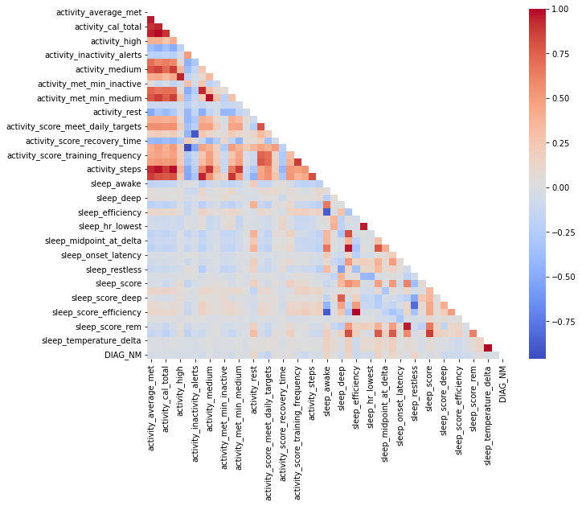

```python
print(df['DIAG_NM'].value_counts())

plt.rcParams['figure.figsize']=[20, 10]
sns.countplot(x='DIAG_NM', data = df)
plt.show()
```

    0    5969
    1    2716
    2     642
    Name: DIAG_NM, dtype: int64

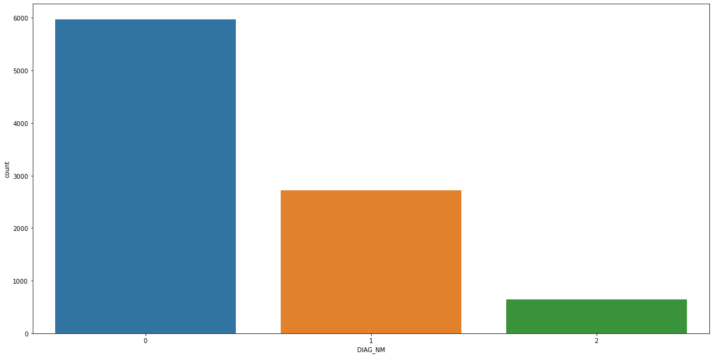

# 2. Modeling

```python
modelResult = pd.DataFrame(columns=['model', 'acc', 'f1', 'auc'])

def printResult(y_test, y_pred, m):
    global modelResult
    print('confusion matrix = ')
    print(f"\n{confusion_matrix(y_test, y_pred)}")
    print('-------------------------------------------')
    print(f"acc = {accuracy_score(y_test, y_pred)}")
    print(f"f1 = {f1_score(y_test, y_pred, average='micro')}")
    labels = [0, 1, 2]
    y_test = preprocessing.label_binarize(y_test, classes=labels)
    y_pred = preprocessing.label_binarize(y_pred, classes=labels)
    print(f"roc_auc_score = {roc_auc_score(y_test, y_pred, multi_class='raise')}")
    print('-------------------------------------------')

    n_classes = 3
    fpr = dict()
    tpr = dict()
    roc_auc = dict()
    for i in range(n_classes):
        fpr[i], tpr[i], _ = roc_curve(y_test[:, i], y_pred[:, i])
        roc_auc[i] = auc(fpr[i], tpr[i])

    # Plot of a ROC curve for a specific class
    plt.figure(figsize=(15, 5))
    for idx, i in enumerate(range(n_classes)):
        plt.subplot(131+idx)
        plt.plot(fpr[i], tpr[i], label='ROC curve (area = %0.2f)' % roc_auc[i])
        plt.plot([0, 1], [0, 1], 'k--')
        plt.xlim([0.0, 1.0])
        plt.ylim([0.0, 1.05])
        plt.xlabel('False Positive Rate')
        plt.ylabel('True Positive Rate')
        plt.title('Class %0.0f' % idx)
        plt.legend(loc="lower right")
    plt.show()

    modelResult = modelResult.append(pd.DataFrame([[m,
                                                    accuracy_score(y_test, y_pred),
                                                    f1_score(y_test, y_pred, average='micro'),
                                                    roc_auc_score(y_test, y_pred, multi_class='raise')]],
                                              columns=['model', 'acc', 'f1', 'auc']))
```

## DecisionTree

### Tuning

```python
X= df.drop(['DIAG_NM'],axis=1)
y= df['DIAG_NM']

X_train, X_test, y_train, y_test = train_test_split(X, y, test_size=0.2, random_state = 11)  # Split 실행

scaler = preprocessing.MinMaxScaler()
scaler.fit(X_train)
X_train_scaled = scaler.transform(X_train)
X_test_scaled = scaler.transform(X_test)
```

```python
for i in range(1,21):
    clf = DecisionTreeClassifier(max_depth = i,random_state=42)
    score = cross_val_score(clf, X_train_scaled, y_train, cv=5)
    print(f"Max_depth: {i}, score = {score.mean()}")
```

    Max_depth: 1, score = 0.6475006688945194
    Max_depth: 2, score = 0.6485727856000029
    Max_depth: 3, score = 0.6487065645038779
    Max_depth: 4, score = 0.6576862714113585
    Max_depth: 5, score = 0.667470627001072
    Max_depth: 6, score = 0.6696139625670466
    Max_depth: 7, score = 0.6737678424246125
    Max_depth: 8, score = 0.6756459545798176
    Max_depth: 9, score = 0.6879773168441108
    Max_depth: 10, score = 0.6882458622813523
    Max_depth: 11, score = 0.6996383480370414
    Max_depth: 12, score = 0.6960208407779648
    Max_depth: 13, score = 0.6934744625948798
    Max_depth: 14, score = 0.6909268274288054
    Max_depth: 15, score = 0.6890501518255883
    Max_depth: 16, score = 0.687309050816231
    Max_depth: 17, score = 0.6869060979836197
    Max_depth: 18, score = 0.6878440766472314
    Max_depth: 19, score = 0.6803387210018513
    Max_depth: 20, score = 0.6847599790981685

```python
MAX_DEPTH = 11
```

```python
X= df.drop('DIAG_NM',axis=1)
y= df['DIAG_NM']
# y= preprocessing.label_binarize(y, classes=[0,1,2])

X_train, X_test, y_train, y_test = train_test_split(X, y, test_size=0.2, random_state = 11)  # Split 실행

scaler = preprocessing.MinMaxScaler()
scaler.fit(X_train)
X_train_scaled = scaler.transform(X_train)
X_test_scaled = scaler.transform(X_test)
tree_clf = DecisionTreeClassifier(max_depth = MAX_DEPTH, random_state=42)
tree_clf.fit(X_train_scaled,y_train)

y_pred = tree_clf.predict(X_test_scaled)

printResult(y_test, y_pred, 'DecisionTree')
```

    confusion matrix =

    [[991 174  16]
     [257 273  10]
     [ 55  21  69]]
    -------------------------------------------
    acc = 0.7143622722400857
    f1 = 0.7143622722400859
    roc_auc_score = 0.7004827071903352
    -------------------------------------------

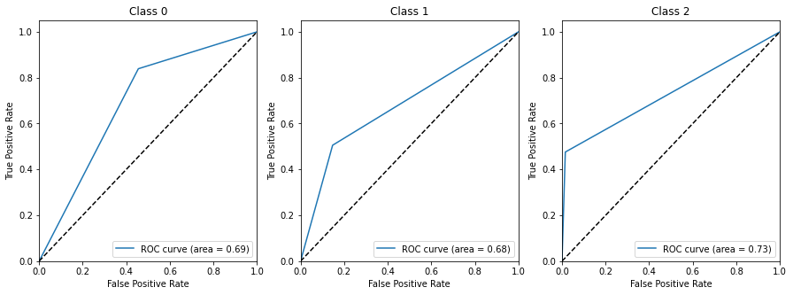

```python
plt.figure(figsize=(8, 6))
sns.scatterplot(data=df, x='sleep_breath_average', y="sleep_rmssd", hue= "DIAG_NM")
```

    <AxesSubplot:xlabel='sleep_breath_average', ylabel='sleep_rmssd'>

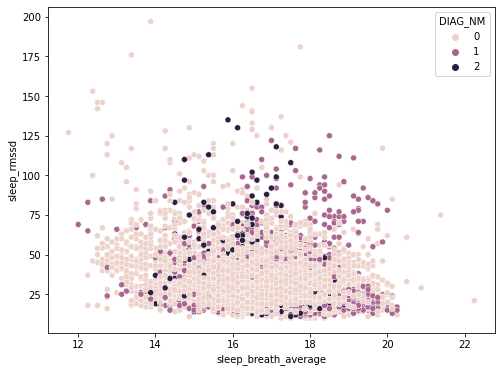

### Feature Importance

```python
imp_df = pd.DataFrame({
    "feature_importances_": tree_clf.feature_importances_,
    "feature_names": X.columns
})
plt.rcParams['figure.figsize']=[10, 5]
sns.barplot(x='feature_names',
            y="feature_importances_",
            data=imp_df,
            order=imp_df.sort_values('feature_importances_',ascending=False).feature_names)
plt.xticks(rotation = 90)

### 변수 선택

imp = imp_df.sort_values('feature_importances_', ascending=False)

# 중요변수순으로 하나씩 추가
nlist=[]
ncount = 0
s_list = []
for n in imp['feature_names']:
    nlist.append(n)
    ncount += 1
    X = df[nlist]
    y = df['DIAG_NM']
    X_train, X_test, y_train, y_test = train_test_split(X, y, test_size= 0.2, random_state = 11)

    scaler = preprocessing.MinMaxScaler()
    scaler.fit(X_train)
    X_train_scaled = scaler.transform(X_train)
    clf = DecisionTreeClassifier(max_depth=MAX_DEPTH,random_state=42)
    score = cross_val_score(clf, X_train_scaled, y_train, cv=5)
    print(f"Num of Variables: {ncount}, score = {score.mean()}")

    s_list.append(score.mean())

plt.plot(s_list)
plt.xlim([0, 50])
plt.ylim([0.55, 0.8])
plt.show()
```

```python
impVarIndex = nlist[0:8]
df[impVarIndex]

X = df[impVarIndex]
y= df['DIAG_NM']

X_train, X_test, y_train, y_test = train_test_split(X, y, test_size=0.2, random_state = 11)  # Split 실행

scaler = preprocessing.MinMaxScaler()
scaler.fit(X_train)
X_train_scaled = scaler.transform(X_train)
X_test_scaled = scaler.transform(X_test)

tree_clf = DecisionTreeClassifier(max_depth=MAX_DEPTH, random_state=42)
tree_clf.fit(X_train_scaled,y_train)

y_pred = tree_clf.predict(X_test_scaled)

printResult(y_test, y_pred)
```

```python
export_graphviz(
        tree_clf, max_depth = 3,
        out_file=os.path.join(IMAGES_PATH, "tree2.dot"),
        feature_names=X.columns,
        rounded=True,
        filled=True
    )
Source.from_file(os.path.join(IMAGES_PATH, "tree2.dot"))
```

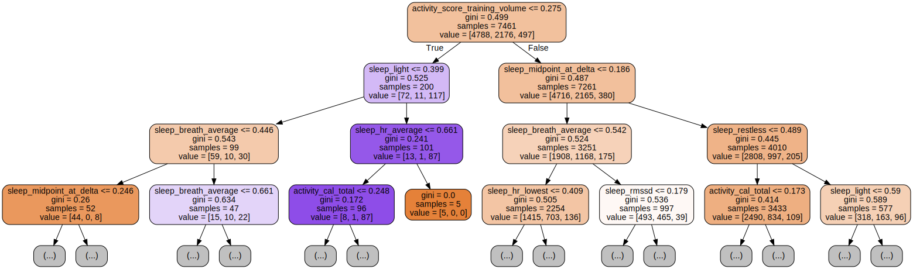

## Logistic Regression

```python
X= df.drop('DIAG_NM',axis=1) # y(종속변수)빼고 입력
y= df['DIAG_NM']

X_train, X_test, y_train, y_test = train_test_split(X, y, test_size=0.2, random_state = 11)  # Split 실행

scaler = preprocessing.StandardScaler()
scaler.fit(X_train)
X_train_scaled = scaler.transform(X_train)
X_test_scaled = scaler.transform(X_test)

model = LogisticRegression()
model.fit(X_train_scaled,y_train)

y_pred = model.predict(X_test_scaled)
printResult(y_test, y_pred, 'LogisticRegression')
```

    confusion matrix =

    [[1069   87   25]
     [ 419  113    8]
     [  71    9   65]]
    -------------------------------------------
    acc = 0.6682743837084673
    f1 = 0.6682743837084673
    roc_auc_score = 0.6259664466874441
    -------------------------------------------

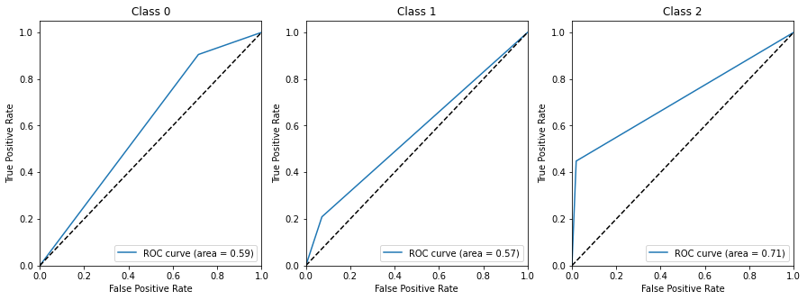

## Randomforest

```python
X= df.drop('DIAG_NM',axis=1)
y= df['DIAG_NM']

X_train, X_test, y_train, y_test = train_test_split(X, y, test_size=0.2, random_state = 11)  # Split 실행

scaler = preprocessing.MinMaxScaler()
scaler.fit(X_train)
X_train_scaled = scaler.transform(X_train)
X_test_scaled = scaler.transform(X_test)

rf_model1 = RandomForestClassifier()
rf_model1.fit(X_train_scaled, y_train)

y_pred = rf_model1.predict(X_test_scaled)
printResult(y_test, y_pred, 'RandomForest')
```

    confusion matrix =

    [[1158   18    5]
     [ 302  237    1]
     [  66    2   77]]
    -------------------------------------------
    acc = 0.7888531618435155
    f1 = 0.7888531618435155
    roc_auc_score = 0.7324421286165249
    -------------------------------------------

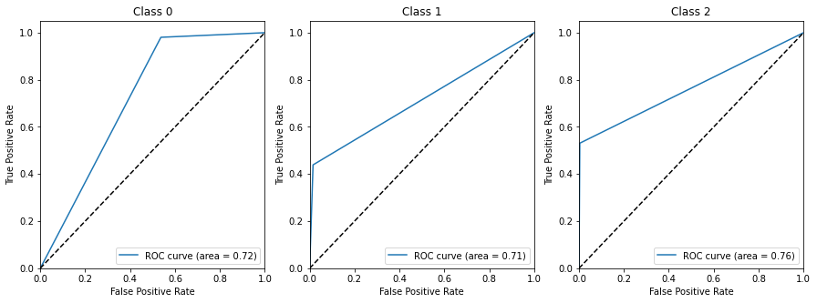

```python
model = RandomForestClassifier()

parameters = { 'n_estimators' : [10, 100],
           'max_depth' : [6, 8, 10, 12],
           'min_samples_leaf' : [8, 12, 18],
           'min_samples_split' : [8, 16, 20]
            }

# RandomForestClassifier 객체 생성 후 GridSearchCV 수행
searcher = GridSearchCV(model, parameters)

# fitting the object
searcher.fit(X_train_scaled, y_train)

# the scores
print("The best params are :", searcher.best_params_)
print("The best score is   :", searcher.best_score_)

# predicting the values
y_pred = searcher.predict(X_test_scaled)

# printing the test accuracy
print("The test accuracy score of SVM after hyper-parameter tuning is ", accuracy_score(y_test, y_pred))
```

    The best params are : {'max_depth': 12, 'min_samples_leaf': 8, 'min_samples_split': 8, 'n_estimators': 10}
    The best score is   : 0.7343509209196089
    The test accuracy score of SVM after hyper-parameter tuning is  0.722400857449089

## kNN

```python
X= df.drop('DIAG_NM',axis=1) # y(종속변수)빼고 입력
y= df['DIAG_NM']

X_train, X_test, y_train, y_test = train_test_split(X, y, test_size=0.2, random_state = 11)  # Split 실행

scaler = preprocessing.MinMaxScaler()
scaler.fit(X_train)
X_train_scaled = scaler.transform(X_train)
X_test_scaled = scaler.transform(X_test)

knn_clf = KNeighborsClassifier()
knn_clf.fit(X_train_scaled, y_train)

y_pred = knn_clf.predict(X_test_scaled)
printResult(y_test, y_pred, 'kNN')
```

    confusion matrix =

    [[1032  139   10]
     [ 223  314    3]
     [  53   15   77]]
    -------------------------------------------
    acc = 0.762593783494105
    f1 = 0.762593783494105
    roc_auc_score = 0.7432899129370713
    -------------------------------------------

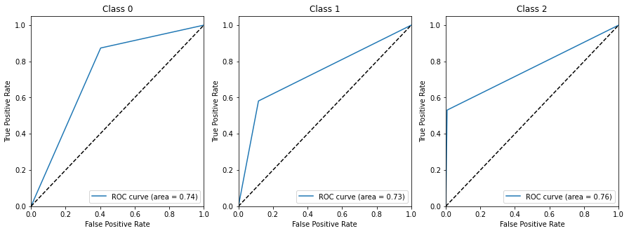

### Optimize

```python
metricList = ['minkowski', 'manhattan']
weightsList = ['uniform', 'distance']
kList = []
for i in range(1,50): #홀수만
    if(i%2 == 1):
        kList.append(i)
```

```python
scaled_cv_acc = pd.DataFrame(columns=['weights', 'metrics', 'k', 'score'])

for w in weightsList:
    for m in metricList:
        for k in kList:
            knn_clf = KNeighborsClassifier(weights = w, n_neighbors = k, metric = m)
            score = cross_val_score(knn_clf, X_train_scaled, y_train, cv=5)
            scaled_cv_acc = scaled_cv_acc.append(pd.DataFrame([[w, m, k, score.mean()]],
                                              columns=['weights', 'metrics', 'k', 'score']))

scaled_cv_acc[scaled_cv_acc['score'] == max(scaled_cv_acc['score'])]
```

<div>
<style scoped>
    .dataframe tbody tr th:only-of-type {
        vertical-align: middle;
    }

    .dataframe tbody tr th {
        vertical-align: top;
    }

    .dataframe thead th {
        text-align: right;
    }

</style>
<table border="1" class="dataframe">
  <thead>
    <tr style="text-align: right;">
      <th></th>
      <th>weights</th>
      <th>metrics</th>
      <th>k</th>
      <th>score</th>
    </tr>
  </thead>
  <tbody>
    <tr>
      <th>0</th>
      <td>distance</td>
      <td>manhattan</td>
      <td>11</td>
      <td>0.800293</td>
    </tr>
  </tbody>
</table>
</div>

```python
knn_clf = KNeighborsClassifier(weights = 'distance', n_neighbors = 11, metric = 'manhattan')
knn_clf.fit(X_train_scaled, y_train)

y_pred = knn_clf.predict(X_test_scaled)
printResult(y_test, y_pred, 'optimized_kNN')
```

    confusion matrix =

    [[1081   94    6]
     [ 228  308    4]
     [  47    8   90]]
    -------------------------------------------
    acc = 0.792604501607717
    f1 = 0.792604501607717
    roc_auc_score = 0.7703654190462865
    -------------------------------------------

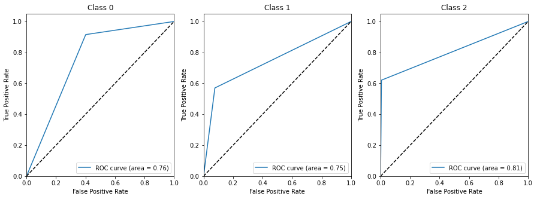

## GaussianNB

```python
model = GaussianNB()
model.fit(X_train_scaled, y_train)

y_pred = model.predict(X_test_scaled)

printResult(y_test, y_pred, 'GaussianNB')
```

    confusion matrix =

    [[594 437 150]
     [196 299  45]
     [ 50  22  73]]
    -------------------------------------------
    acc = 0.5176848874598071
    f1 = 0.5176848874598071
    roc_auc_score = 0.6235885697804977
    -------------------------------------------

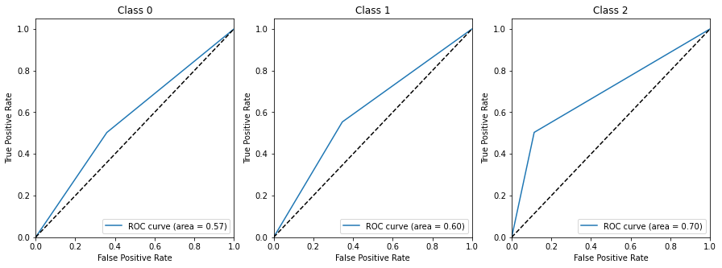

## SVM

```python
model = SVC()
model.fit(X_train_scaled, y_train)

y_pred = model.predict(X_test_scaled)
printResult(y_test, y_pred, 'SVC')
```

    confusion matrix =

    [[1166    7    8]
     [ 465   71    4]
     [  85    0   60]]
    -------------------------------------------
    acc = 0.695069667738478
    f1 = 0.695069667738478
    roc_auc_score = 0.6195670085252258
    -------------------------------------------

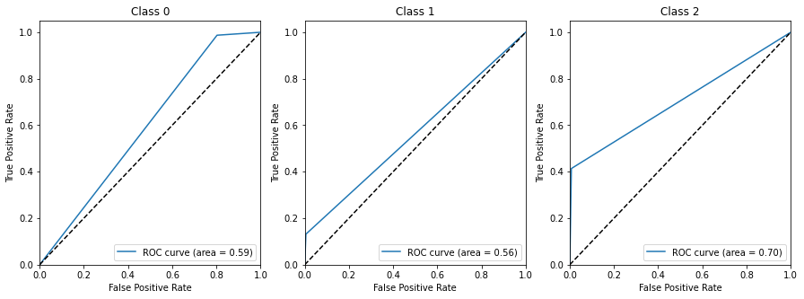

### Optimize SVM

```python
# instantiating the object
svm = SVC()

# setting a grid - not so extensive
parameters = {"C":np.arange(1,10,1),'gamma':[0.00001,0.00005, 0.0001,0.0005,0.001,0.005,0.01,0.05,0.1,0.5,1,5]}

# instantiating the GridSearchCV object
searcher = GridSearchCV(svm, parameters)

# fitting the object
searcher.fit(X_train_scaled, y_train)

# the scores
print("The best params are :", searcher.best_params_)
print("The best score is   :", searcher.best_score_)

# predicting the values
y_pred = searcher.predict(X_test_scaled)

# printing the test accuracy
print("The test accuracy score of SVM after hyper-parameter tuning is ", accuracy_score(y_test, y_pred))
```

    The best params are : {'C': 8, 'gamma': 1}
    The best score is   : 0.8252234287263711
    The test accuracy score of SVM after hyper-parameter tuning is  0.8397642015005359

```python
model = SVC(C=8, gamma=1)
model.fit(X_train_scaled, y_train)

y_pred = model.predict(X_test_scaled)
printResult(y_test, y_pred, 'optimizedSVC')
```

    confusion matrix =

    [[1098   72   11]
     [ 173  361    6]
     [  33    4  108]]
    -------------------------------------------
    acc = 0.8397642015005359
    f1 = 0.8397642015005359
    roc_auc_score = 0.8291905902992859
    -------------------------------------------

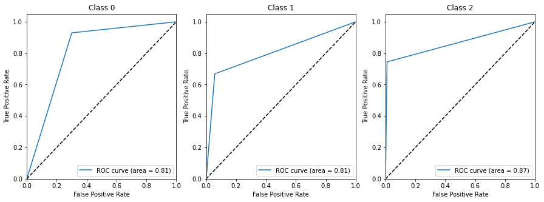

## XGBoost

```python
model = xgb.XGBClassifier(use_label_encoder=False, eval_metric='mlogloss')
model.fit(X_train_scaled, y_train)

y_pred = model.predict(X_test_scaled)

printResult(y_test, y_pred, 'xgb')
```

    confusion matrix =

    [[1137   40    4]
     [ 183  354    3]
     [  39    6  100]]
    -------------------------------------------
    acc = 0.852625937834941
    f1 = 0.852625937834941
    roc_auc_score = 0.8241847287372556
    -------------------------------------------

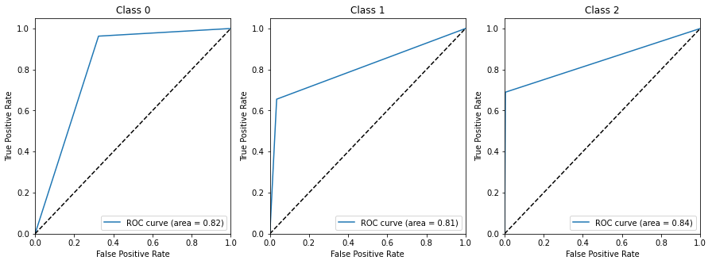

### 변수중요도 및 변수선택

```python
imp_df = pd.DataFrame({
    "feature_importances_": model.feature_importances_,
    "feature_names": X.columns
})
plt.rcParams['figure.figsize']=[10, 5]
sns.barplot(x='feature_names',
            y="feature_importances_",
            data=imp_df,
            order=imp_df.sort_values('feature_importances_',ascending=False).feature_names)
plt.xticks(rotation = 90)

### 변수 선택
```

    (array([ 0,  1,  2,  3,  4,  5,  6,  7,  8,  9, 10, 11, 12, 13, 14, 15, 16,
            17, 18, 19, 20, 21, 22, 23, 24, 25, 26, 27, 28, 29, 30, 31, 32, 33,
            34, 35, 36, 37, 38, 39, 40, 41, 42, 43, 44, 45, 46, 47]),
     [Text(0, 0, 'activity_score_meet_daily_targets'),
      Text(1, 0, 'sleep_hr_lowest'),
      Text(2, 0, 'activity_score_training_volume'),
      Text(3, 0, 'sleep_breath_average'),
      Text(4, 0, 'activity_score_move_every_hour'),
      Text(5, 0, 'activity_total'),
      Text(6, 0, 'sleep_light'),
      Text(7, 0, 'sleep_midpoint_at_delta'),
      Text(8, 0, 'sleep_rmssd'),
      Text(9, 0, 'activity_cal_total'),
      Text(10, 0, 'sleep_score_rem'),
      Text(11, 0, 'activity_daily_movement'),
      Text(12, 0, 'activity_score'),
      Text(13, 0, 'activity_score_recovery_time'),
      Text(14, 0, 'activity_met_min_inactive'),
      Text(15, 0, 'activity_medium'),
      Text(16, 0, 'sleep_score_alignment'),
      Text(17, 0, 'sleep_hr_average'),
      Text(18, 0, 'activity_met_min_medium'),
      Text(19, 0, 'activity_score_training_frequency'),
      Text(20, 0, 'activity_score_stay_active'),
      Text(21, 0, 'activity_rest'),
      Text(22, 0, 'activity_met_min_high'),
      Text(23, 0, 'sleep_restless'),
      Text(24, 0, 'sleep_awake'),
      Text(25, 0, 'sleep_score_deep'),
      Text(26, 0, 'activity_met_min_low'),
      Text(27, 0, 'sleep_score_disturbances'),
      Text(28, 0, 'sleep_duration'),
      Text(29, 0, 'sleep_rem'),
      Text(30, 0, 'activity_average_met'),
      Text(31, 0, 'activity_high'),
      Text(32, 0, 'sleep_deep'),
      Text(33, 0, 'sleep_efficiency'),
      Text(34, 0, 'activity_low'),
      Text(35, 0, 'sleep_score_efficiency'),
      Text(36, 0, 'activity_inactive'),
      Text(37, 0, 'activity_cal_active'),
      Text(38, 0, 'sleep_midpoint_time'),
      Text(39, 0, 'activity_steps'),
      Text(40, 0, 'sleep_onset_latency'),
      Text(41, 0, 'sleep_score_total'),
      Text(42, 0, 'sleep_temperature_delta'),
      Text(43, 0, 'sleep_score'),
      Text(44, 0, 'activity_non_wear'),
      Text(45, 0, 'activity_inactivity_alerts'),
      Text(46, 0, 'sleep_score_latency'),
      Text(47, 0, 'sleep_temperature_deviation')])

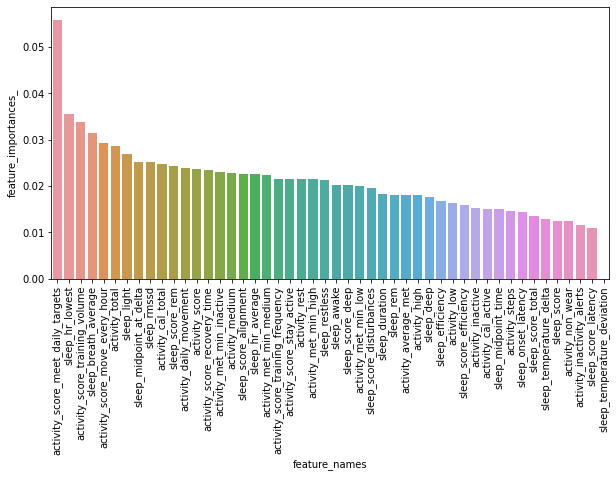

```python
imp = imp_df.sort_values('feature_importances_', ascending=False)

# 중요변수순으로 하나씩 추가
nlist=[]
ncount = 0
s_list = []
for n in imp['feature_names']:
    nlist.append(n)
    ncount += 1
    X = df[nlist]
    y = df['DIAG_NM']
    X_train, X_test, y_train, y_test = train_test_split(X, y, test_size= 0.2, random_state = 11)

    scaler = preprocessing.MinMaxScaler()
    scaler.fit(X_train)
    X_train_scaled = scaler.transform(X_train)

    model = xgb.XGBClassifier(use_label_encoder=False, eval_metric='mlogloss')
    model.fit(X_train_scaled, y_train)
    score = cross_val_score(model, X_train_scaled, y_train, cv=5)
    print(f"Num of Variables: {ncount}, score = {score.mean()}")

    s_list.append(score.mean())

plt.plot(s_list)
plt.xlim([0, 50])
plt.ylim([0, 1])
plt.show()
```

    Num of Variables: 1, score = 0.6417370427499914
    Num of Variables: 2, score = 0.6405303390801398
    Num of Variables: 3, score = 0.6492428473178677
    Num of Variables: 4, score = 0.682214857898073
    Num of Variables: 5, score = 0.6867724088642442
    Num of Variables: 6, score = 0.7044625589659699
    Num of Variables: 7, score = 0.7138454880595595
    Num of Variables: 8, score = 0.7381040925570446
    Num of Variables: 9, score = 0.7705407181682526
    Num of Variables: 10, score = 0.7831390995333003
    Num of Variables: 11, score = 0.7976145156395619
    Num of Variables: 12, score = 0.8002946727265219
    Num of Variables: 13, score = 0.8072638353424113
    Num of Variables: 14, score = 0.8079345255517707
    Num of Variables: 15, score = 0.8124912684574486
    Num of Variables: 16, score = 0.8138332773676622
    Num of Variables: 17, score = 0.8126242393008303
    Num of Variables: 18, score = 0.820668122372681
    Num of Variables: 19, score = 0.8221417553587879
    Num of Variables: 20, score = 0.8236144007154029
    Num of Variables: 21, score = 0.8281727597420672
    Num of Variables: 22, score = 0.8252236082953696
    Num of Variables: 23, score = 0.8269654275807208
    Num of Variables: 24, score = 0.8356779358184486
    Num of Variables: 25, score = 0.8399671209163765
    Num of Variables: 26, score = 0.8469364631012644
    Num of Variables: 27, score = 0.8433177886436974
    Num of Variables: 28, score = 0.8458649748872755
    Num of Variables: 29, score = 0.8489475460998511
    Num of Variables: 30, score = 0.8504218075774526
    Num of Variables: 31, score = 0.8498856145479621
    Num of Variables: 32, score = 0.8484114428548597
    Num of Variables: 33, score = 0.847070870496634
    Num of Variables: 34, score = 0.8450596079290488
    Num of Variables: 35, score = 0.8462677481508882
    Num of Variables: 36, score = 0.8488144854719701
    Num of Variables: 37, score = 0.8508228749355796
    Num of Variables: 38, score = 0.8458647953182771
    Num of Variables: 39, score = 0.850555766050326
    Num of Variables: 40, score = 0.8470721274796233
    Num of Variables: 41, score = 0.8478742621958775
    Num of Variables: 42, score = 0.8429161825785749
    Num of Variables: 43, score = 0.8453286920732858
    Num of Variables: 44, score = 0.8470718581261257
    Num of Variables: 45, score = 0.846534587682644
    Num of Variables: 46, score = 0.8488125102129868
    Num of Variables: 47, score = 0.8438539816731879
    Num of Variables: 48, score = 0.8438539816731879

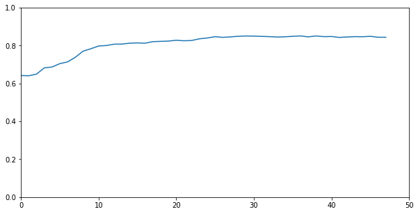

```python
plt.plot(s_list)
plt.xlim([0, 47])
plt.ylim([0.6, 0.87])
plt.plot([30, 30], [0.6, 1], color="red", linestyle="--")
plt.show()
```

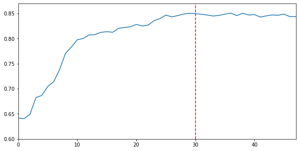

```python
fig, ax = plt.subplots(figsize=(30, 30))

plot_tree(model,num_trees=0,rankdir="LR",ax=ax)
plt.show()
```

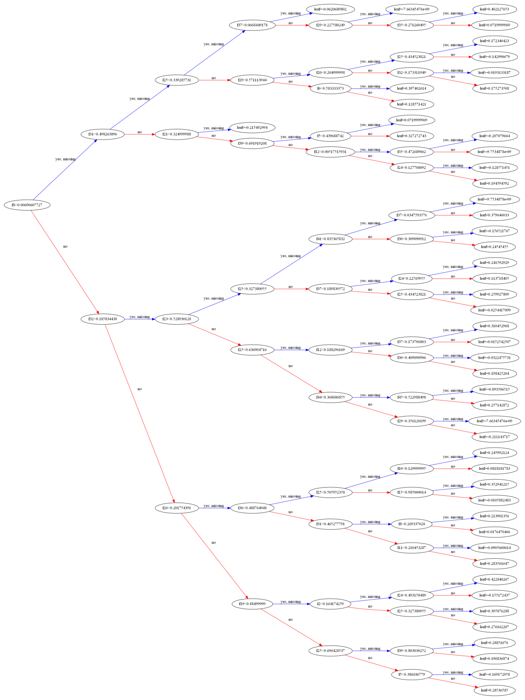

## 평가

```python
modelResult
```

<div>
<style scoped>
    .dataframe tbody tr th:only-of-type {
        vertical-align: middle;
    }

    .dataframe tbody tr th {
        vertical-align: top;
    }

    .dataframe thead th {
        text-align: right;
    }

</style>
<table border="1" class="dataframe">
  <thead>
    <tr style="text-align: right;">
      <th></th>
      <th>model</th>
      <th>acc</th>
      <th>f1</th>
      <th>auc</th>
    </tr>
  </thead>
  <tbody>
    <tr>
      <th>0</th>
      <td>DecisionTree</td>
      <td>0.714362</td>
      <td>0.714362</td>
      <td>0.700483</td>
    </tr>
    <tr>
      <th>0</th>
      <td>LogisticRegression</td>
      <td>0.668274</td>
      <td>0.668274</td>
      <td>0.625966</td>
    </tr>
    <tr>
      <th>0</th>
      <td>RandomForest</td>
      <td>0.788317</td>
      <td>0.788317</td>
      <td>0.73189</td>
    </tr>
    <tr>
      <th>0</th>
      <td>optimized_kNN</td>
      <td>0.792605</td>
      <td>0.792605</td>
      <td>0.770365</td>
    </tr>
    <tr>
      <th>0</th>
      <td>kNN</td>
      <td>0.762594</td>
      <td>0.762594</td>
      <td>0.74329</td>
    </tr>
    <tr>
      <th>0</th>
      <td>GaussianNB</td>
      <td>0.517685</td>
      <td>0.517685</td>
      <td>0.623589</td>
    </tr>
    <tr>
      <th>0</th>
      <td>SVC</td>
      <td>0.69507</td>
      <td>0.69507</td>
      <td>0.619567</td>
    </tr>
    <tr>
      <th>0</th>
      <td>optimizedSVC</td>
      <td>0.839764</td>
      <td>0.839764</td>
      <td>0.829191</td>
    </tr>
    <tr>
      <th>0</th>
      <td>xgb</td>
      <td>0.852626</td>
      <td>0.852626</td>
      <td>0.824185</td>
    </tr>
  </tbody>
</table>
</div>

```python
users = modelResult.model

x = modelResult.acc
y =  modelResult.f1
s = modelResult.auc

result_df = pd.DataFrame(dict(acc=x, f1=y, users=users, s=(pd.to_numeric(s)*8**3))) # size 크기는 값에 다라 조정

# 그래프 그리기
plt.rcParams['figure.figsize']=[5, 5]
ax = result_df.plot.scatter(x='acc', y='f1', s=result_df.s, alpha=0.5)
for i, txt in enumerate(users):
    ax.annotate(txt, (result_df.acc.iat[i],result_df.f1.iat[i]))
plt.show()
```

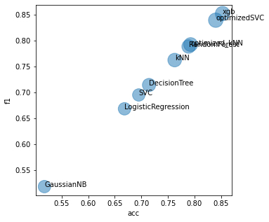

```python
plt.rcParams['figure.figsize']=[15, 5]
plt.bar(modelResult['model'],modelResult['f1'])
# plt.xticks(x, years)

plt.show()
```

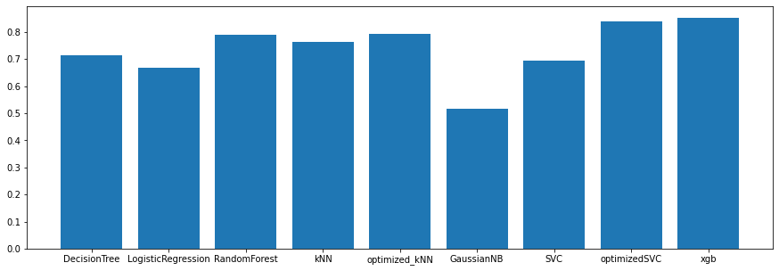

```python
plt.rcParams['figure.figsize']=[15, 5]
plt.bar(modelResult['model'],modelResult['acc'])
# plt.xticks(x, years)

plt.show()
```


```python
plt.rcParams['figure.figsize']=[15, 5]
plt.bar(modelResult['model'],modelResult['auc'])
# plt.xticks(x, years)

plt.show()
```

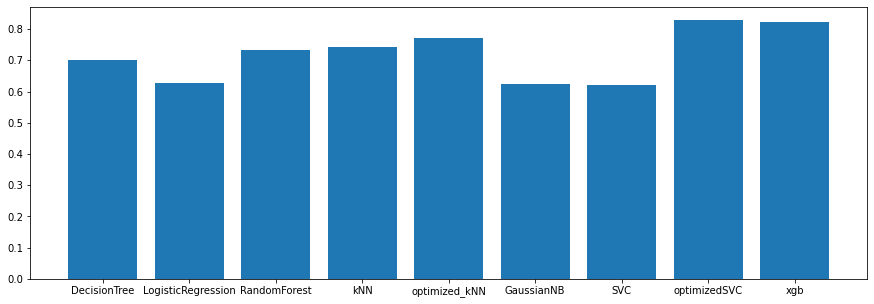
